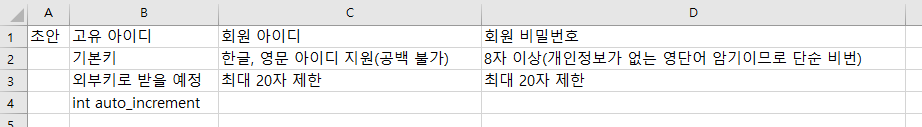

# ToyProject

- [ToyProject](#toyproject)
  - [프로젝트 목표](#프로젝트-목표)
  - [구조](#구조)
  - [해야할 일](#해야할-일)
  - [프로젝트 팀 구성](#프로젝트-팀-구성)
    - [서버 관리 팀](#서버-관리-팀)
    - [디자인 팀](#디자인-팀)
    - [프론트앤드 팀](#프론트앤드-팀)
    - [백앤팀(Flask) 팀](#백앤팀flask-팀)
    - [데이터베이스 팀](#데이터베이스-팀)
    - [데이터 분석 팀](#데이터-분석-팀)
  - [프로젝트 진행상황](#프로젝트-진행상황)

## 프로젝트 목표

- 서버에 영단어 암기앱을 서비스한다

## 구조

- 서버 : GCP(2cpu, 2기가 메모리)
  - github pull을 사용하여 서버 상태 관리
  - 사전에 로컬에서 테스트 이후 서비스 갱신
  - 로깅을 사용하여 디버그

- 데이터베이스 : sqlite or mysql
  - 유저 데이터 저장
  - 영단어 데이터 저장
  - 영단어 북마크 저장
  - 영단어 분석 데이터 저장
  - 데이터베이스 설계

- 백앤드 : flask
  - 프론트앤드 react와 연동
  - 로그인페이지 추가.
    - 로그인 암호화-> 데이터베이스
    - 세션을 사용하여 관리

- 프론트앤드 : react
  - 백앤드 flask에 프록시를 사용하여 내부 통신
  - 로그인 페이지.
  - day를 불러오기(1개 또는 범위)
    - 연습
      - 읽기(영어, 뜻)
      - 쓰기(영어)
        - 틀린 내용을 기록하고 그날 연습 동안 기록
        - 쿠키를 활용하여 관리
    - 테스트
      - 쓰기(틀린 영단어 저장, 이후 분석에 사용)

## 해야할 일

- ~~그림(PPT, 이쁘장한 툴 사용)을 그려 프로젝트를 기획한다.~~ 초안 완성
- 서버 환경 구축/ react 가동, flask 진행중
  - flask 서버는 외부접근 불가하게 만들 예정...
  - 내부적으로 react 통신.
  - axios 필요 = 환경설정 추가.....
- 먼저 React 기본 구조만 만들고 서버에서 가동시키기.
- 로컬에서 서비스 초안 구성
- 데이터베이스 설계
  - 영단어 데이터베이스 추가하기

## 프로젝트 팀 구성

### 서버 관리 팀

- 뉴 팀장 이재근
[팀장이 공부할 내용](https://kim-dragon.tistory.com/99)
[팀장이 공부할 내용2](http://biscuitpress.kr/544)

- 이후 서비스 시작하면 트래픽으로 인한 서버 다운 걱정으로 새로 취임한 팀장

- 이벤트 규모 파악
  - 이벤트 랜딩 페이지 점검(메인 도메인)
    - 부하(Stress) 테스트(테스트 시나리오)
      - 성능지연 원인 분석/수정
        - 이벤트 당일 모니터링/대응

- 페이지 서비스 이후 트레픽 파악하기.

### 디자인 팀

- 팀장 이재근

- 디자인 철학 : 녹색
  - 영단어 공부를 위한 눈이 피곤하지 않은 연한 녹색 위주 디자인

### 프론트앤드 팀

- 팀장 이재근

- 우선적으로 React 부터 만들어서 서버에 올리자.
  - 페이지 구성을 먼저 하고 이후 기능 추가.

### 백앤팀(Flask) 팀

- 팀장 이재근

- 플라스크에서 api를 통해 데이터 전달.

### 데이터베이스 팀

- 팀장 이재근

- 회원정보 데이터베이스

- 영단어 데이터베이스

- 북마크 데이터베이스

- 영단어 분석 데이터베이스

### 데이터 분석 팀

- 팀장 이재근

영어 데이터 분석 파트

읽기 모드에서 노출 빈도와 테스트의 정답 여부 분석

테스트 통과 시간을 저장 몇일이 지나야 잊어먹는가 분석

## 프로젝트 진행상황

- 1일차

GCP 결제 연동 및 VM 인스턴스 만들기

- Compute Engine 구입
  - CPU 2개, 메모리 2기가(기본 4기가이지만 가격을 고려하여 다운그레이드) 1일 25원
  - Ubuntu 18.04 LTS
  - 저장공간 10기가 (부족할 시 추가)

***

- 2일차

~~재미있는 그림그리기 시간~~

프로젝트 설계

- 서버 환경 준비
  - apt 업데이트
  - nodejs, npm 다운 ~~(여기서부터 에러...  `E: Unable to acquire the dpkg frontend lock (/var/lib/dpkg/lock-frontend), is another process using it?`)~~ 해결
    - ~~구글링이 체고시다~~

***

- 3일차

React와 Flask 서버에 올리고, 환경 관리

- ~~벌서부터 무섭다ㄷㄷ~~
- 시작부터 에러 `npm i` (최신 npm 버전과, root권한 문제)... ? 터미널이 멈췄다? 망했다?
  - 아아아아.... gcp에서 꺼지지도 않는다....
  - 난 망했어... 우린 이제 끝이야....
    - 서버를 살리고 npm i  문제도 모두 해결했다...
    - 하지만 build가 되지 않는다...
      - 권한, 소유권 전부 해결... 실행되지 않는데
        - routes 를 사용해야해서 새로운 문법으로 수정 해도 되지 않는다
          - 방화벽 문제라 판단...
- 연결 성공..........

- 내일은 플라스크다...

***

- 4일차

- sudo apt-get update
- sudo apt-get python3.8
- sudo apt intall python3-pip
- pip3 install flask
- pip3 install requests
- pip3 install flask_restful
- pip3 install pymysql
- pip3 install flask_cors

- sudo npm install axios

...그리고 로컬에서 실험도 안하고 서버로 올리지 말자...

- CORS 문제발생... proxy
- npm install http-proxy-middleware
- 기브업... CORS 문제를 어떻게든 해결해야한다...

***

- 5일차

- CORS 문제 해결, Flask 에서 모든 접근을 허용
  - 보안 문제발생, flask 포트는 GCP 방화벽에 차단당하지만 접근 보안 고민

- `export FLASK_ENV=development`
- `export FLASK_DEBUG=1`
- `export FLASK_APP=flask_app/__init__.py`

- flask가 안되는 건가, react에서 방화벽에 막혀서
- api를 못가져오는건가?
